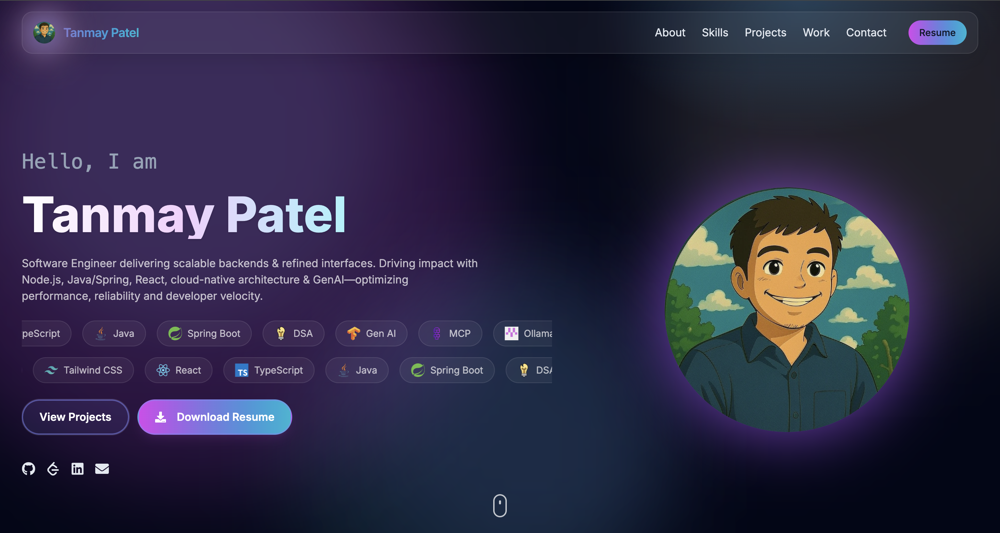

# Developer Portfolio

> A modern, responsive developer portfolio showcasing skills, projects, and professional experience.

## ✨ Features

- **Modern Design**: Clean, professional interface with smooth animations
- **Fully Responsive**: Optimized for mobile, tablet, and desktop viewing
- **Interactive Skills**: Flip cards with detailed descriptions and experience levels
- **Work Timeline**: Chrome tab-style company selection with expandable role details
- **Project Showcase**: Highlighting key development projects and achievements
- **Contact Form**: Direct messaging capability with EmailJS integration

## 🛠️ Built With

- **React** + **Vite** - Fast, modern development
- **Tailwind CSS** - Utility-first styling
- **Framer Motion** - Smooth animations and transitions
- **EmailJS** - Contact form functionality

## 🎯 Highlights

- **Mobile-First Design**: Two-row horizontal scrolling for skills, intuitive navigation
- **Professional Timeline**: Detailed work experience with role-specific achievements
- **Performance Optimized**: Fast loading and smooth interactions
- **Modern UI/UX**: Chrome tab-inspired design elements and clean aesthetics

---

**Live Portfolio**: [View Demo](https://tanmay-patel.netlify.app)

Built by **Tanmay Patel** - Full Stack Developer specializing in React, Java, and AI technologies.
